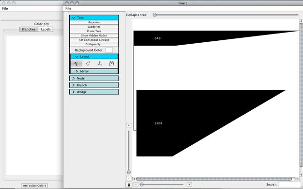
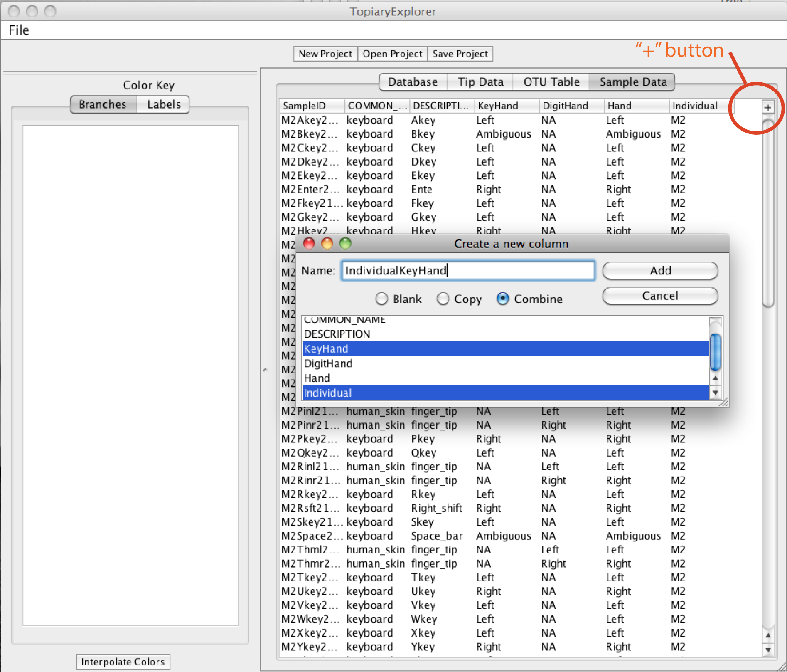
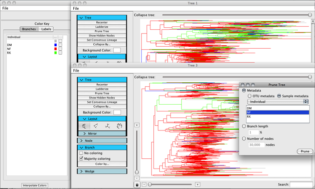

.. _quickstart:

*******************
Quickstart Tutorial
*******************
This quick start tutorial is a task-oriented example showing the shortest path to a dynamically colored tree that can be explored, manipulated, and exported as a PDF.

This tutorial uses a tree and metadata derived from a reanalysis of the data from `"Forensic identification using skin bacterial communities" (Fierer et al., 2010 PNAS) <http://www.ncbi.nlm.nih.gov/pubmed/20231444>`_. Basic data analysis was performed in May of 2011 using `QIIME <http://www.qiime.org>`_.

Tutorial Input Files
--------------------
All of the files you need to complete this tutorial are packaged in the ``examples`` directory of the TopiaryExplorer package. (See the **install page** if you haven't yet installed TopiaryExplorer. **MEG: please add link to the install page**) 

The TopiaryExplorer project file (.tep)
^^^^^^^^^^^^^^^^^^^^^^^^^^^^^^^^^^^^^^^
The ``examples/keyboard.tep`` file is a Topiary Explorer Project file (.tep) created for use in this tutorial. The tree and all related metadata is stored in this file. We'll use this file in the tutorial.

.tep files are composites of the other files packaged in the TopiaryExplorer project directory. You'll typically start by loading these files independently possibly saving them as a single .tep file to facilitate project management and sharing of data. These independent files are:

 * Newick-format tree (keyboard.tre): a tree in newick_ format with tip labels and branch lengths.
 * tip metadata (keyboard_tip_metadata.txt): metadata associated with tips (e.g., taxonomic assignments). This file is not necessary if the user only wishes to color by sample/environmental metadata. If you're working with QIIME, this file can be generated by adding column headers to the output of `assign_taxonomy.py <http://qiime.org/scripts/assign_taxonomy.html>`_.
 * Tip abundance matrix (keyboard_otu_table.txt): a matrix mapping tips to their abundance in one or more samples. This file can be generate by the user in Excel (save as tab-delimited text) or by the `make_otu_table.py <http://qiime.org/scripts/make_otu_table.html>`_ script in QIIME. This is a `QIIME-compatible OTU table <http://qiime.org/documentation/file_formats.html#otu-table>`_. This file is not needed if the user only wishes to color by tip metadata.
 * Sample/environment data (keyboard_mapping.txt): a matrix mapping samples/environments to data about those environments. This file can be generated by the user in Excel (save as tab-delimited text) and is a `QIIME-compatible mapping file <http://qiime.org/documentation/file_formats.html#metadata-mapping-files>`_.

Step 1. Running TopiaryExplorer
-------------------------------
Navigate to the /main directory after checking out the package from SVN.

To run TopiaryExplorer::
	
	javaws topiaryexplorer.jnlp

When successfully run, you should get a window that looks like the following.

.. figure::  _images/blank.png
   :align:   center

   A newly opened TopiaryExplorer window.

Step 2. Opening the .tep file
-----------------------------
Using the Open Project button located at the top of the TopiaryExplorer window, navigate to the examples folder containing :file:`keyboard.tep` and open the file.

   A newly opened project.

Step 3. Uncollapsing the tree
-----------------------------
Using the collapse tree toolbar located near the top of the new TreeWindow, drag the slider to the right to fully uncollapse the tree.

Step 4. Editing & saving metadata
---------------------------------
In the TopiaryExplorer window, you will find a button in the top right corner of each metadata table. This button allows you to add new columns to a table or to save a table as tab delimited text.

In the Sample Metadata Mapping tab, add a new column by combining the columns Individual and Source. If you scroll to the right you will see this column at the end.

Now save your edited Sample Metadata Mapping table as tab delimited text.

   Add column dialog.

Step 5. Coloring the tree
-------------------------
To color the tree's branches, open the branch panel of the Tree Toolbar which is located on the left side of the TreeWindow. Click the "Color By..." button and select a sample metadata category to color by, such as "Individual". 

By default each option for the category will be colored gray. In the TopiaryExplorer window use the Color Key to select the desired colors. The small boxes in the same row as the intended option are used to show the current color, and when clicked will change the color of the corresponding option. 

To reproduce the images shown in this tutorial, color the DM option blue, the NF option red and the RK option green. 

.. figure::  _images/color_by.png
   :align:   center

   A tree colored by metadata.

Step 6. Opening a subtree
-------------------------
In order to study the tree more carefully, you may want to focus on smaller subtrees of a larger tree.

To view a subtree more closely, right click on the root node of the subtree of interest and then click View Subtree in new Window.

.. figure::  _images/view_subtree.png
   :align:   center

   Subtree viewed in a new window.

Step 7. Pruning the tree
------------------------
To remove unwanted branches, use the prune tree button at the top of the tree toolbar.

In the subtree window, we are going to remove branches based on sample metadata. Click the prune tree button, then select the metadata radio button, followed by the sample metadata radio button, and then choose a field to prune by. Since we already have the trees colored by individual, select this field, and then some value.

When you click prune, you should see that all of the branches that were colored by whichever value you chose have now been pruned.

.. figure::  _images/pruned.png
   :align:   left

Step 8. Saving a new project
----------------------------
To save your modified metadata and trees, click the Save Project button at the top of the TopiaryExplorer window.

.. _newick: http://en.wikipedia.org/wiki/Newick_format
.. _QIIME: http://qiime.org
