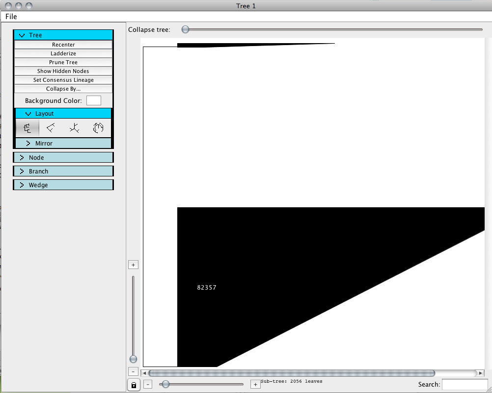
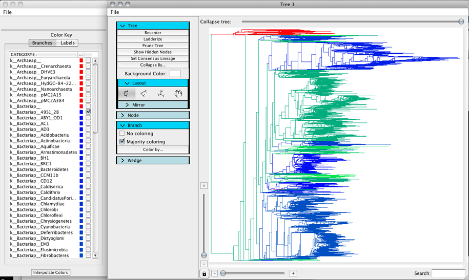
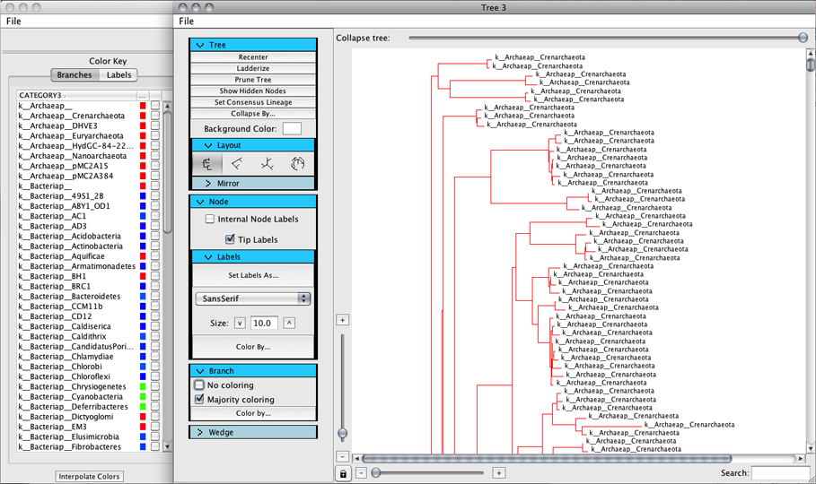

.. _bigtree_tutorial:

*****************
Big tree tutorial
*****************
This tutorial shows how to load data from a large tree on the order of 100k nodes. The tree used in this tutorial is the GreenGenes tree with OTUs picked at 99%.

Assumptions made in this tutorial
---------------------------------

 * Prior to working through this tutorial we recommend running through the `TopiaryExplorer Overview Tutorial <./quickstart.html>`_ which will show you how to work with the basic features of TopiaryExplorer. This tutorial assumes that you already know how to load the TopiaryExplorer application and that you have some familiarity with the basic interface.

Step 1. Create a new project
----------------------------
Create a new project using the new project dialog. Open the tree and related tip data.

Step 2. Color the tree
----------------------
Uncollapse the tree and then color the branches by kingdom_phylum.

.. note:: Using the interpolate colors function with a tree of this size can take a very long time.

Step 3. Open a subtree and set tip labels
-----------------------------------------
Open a subtree (This is the archaea subtree with ~2000 nodes) in a new window and zoom in so that there is enough space for labels to show. Set tip labels as kingdom_phylum.

