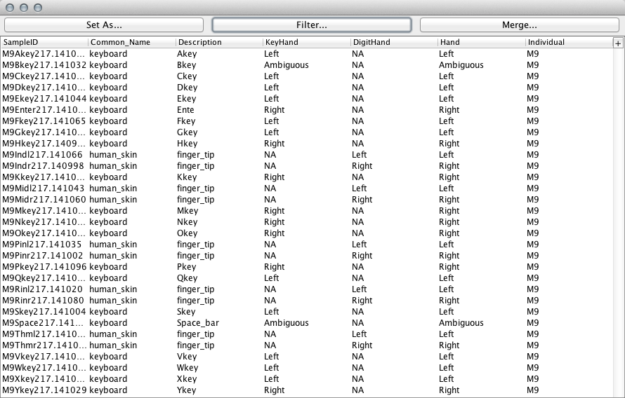
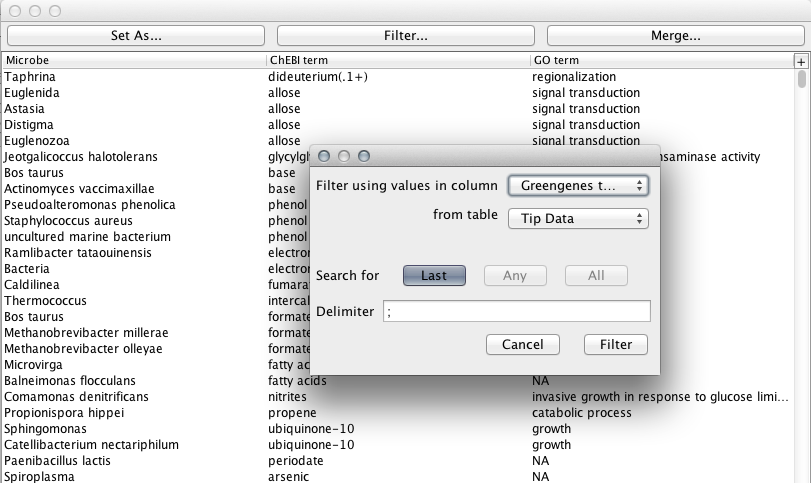
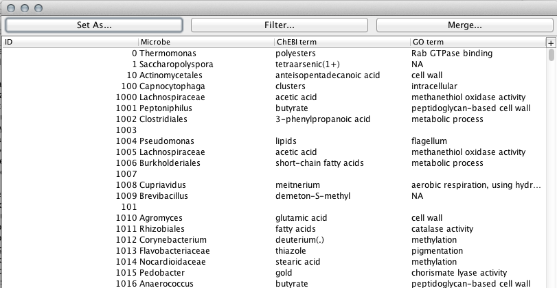
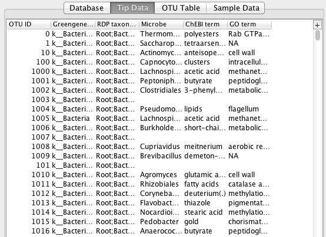

.. _data_table_window:

****************
Datatable Window
****************
This guide explains all of the functions that a user can perform in the Datatable window. 

Datatable windows are used when viewing tables from a database connection, covered in the `Database Tutorial <./data_table.html>`_, or when opening arbitrary tab-delimited text tables, which can be done from the file menu.

Set As... Button
================
The Set As... button located at the top of the Datatable window is used to set the current table as one of the main 3 TopiaryExplorer tables, Tip metadata, OTU table or Sample data. It will completely replace anything that was previously loaded in the table selected to replace.

Filter... Button
================
The Filter button will filter the Datatable based on data that is already loaded into one of the main TopiaryExplorer tables.

For example, if you loaded in a table of microbe attributes with the first column corresponding to the microbe name, you could then filter the table down to only microbes found in a column of your Tip Data table. Pressing the filter button with the corresponding options set will result in an additional Datatable window.

   Microbe Attribute Datatable

   Filtered Datatable

.. note:: The current filter functionality is built to work only with taxonomy string matches, case insensitive. It will only match to the last delimited term from the taxonomy string.

Merge... Button
===============
The Merge button will append the current Datatable to one of the main 3 TopiaryExplorer tables, provided the first columns of both the current Datatable and the loaded Datatable have some intersection.

