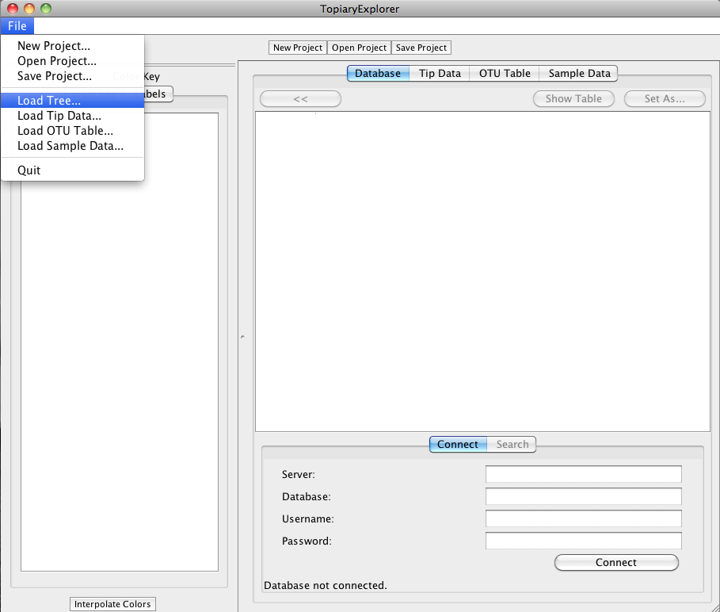
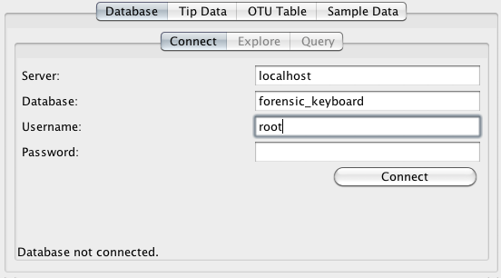
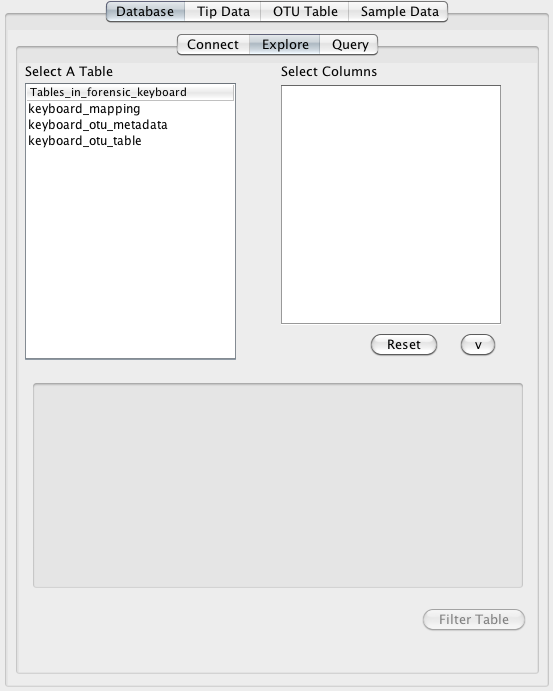
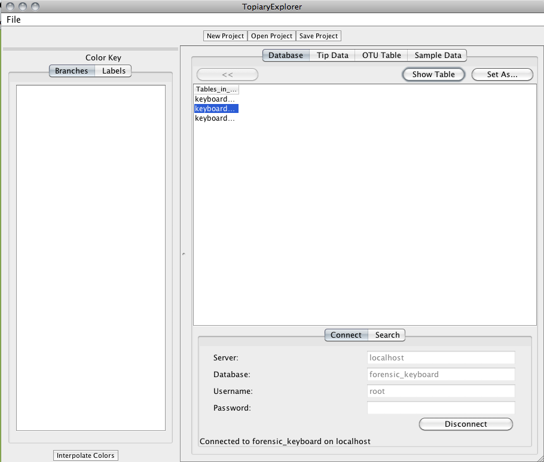
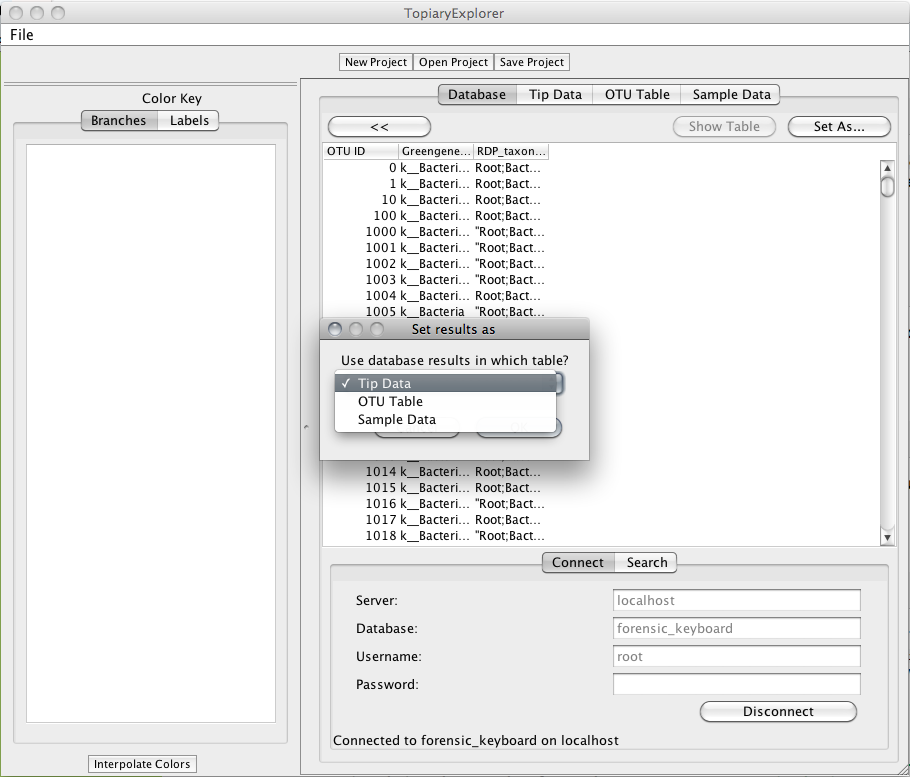
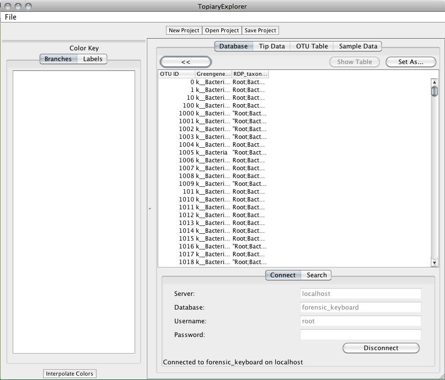
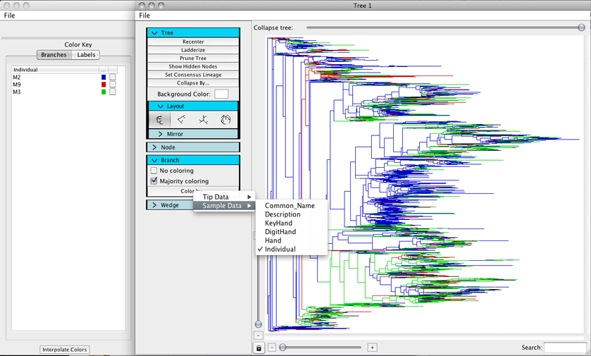

.. _database_connectivity:

******************************
Database connectivity tutorial
******************************
This tutorial shows how to load data from a locally running mysql database into TopiaryExplorer to  pull tip Data, OTU table, or sample data. 

Assumptions made in this tutorial
---------------------------------

 * Prior to working through this tutorial we recommend running through the `TopiaryExplorer Overview Tutorial <./quickstart.rst>`_ which will show you how to work with the basic features of TopiaryExplorer. This tutorial assumes that you already know how to load the TopiaryExplorer application and that you have some familiarity with the basic interface.

 * You should also first review the `TopiaryExplorer Window <./topiaryexplorer_window.html>`_ guide, which covers the Database Pane.

 * [DOUG PLEASE EDIT!!] You have a working mysql database on your system, with a user account already created.

Tutorial Input Files
--------------------
All of the files you need to complete this tutorial are packaged in the ``examples`` directory of the TopiaryExplorer package.

 * mysql Database Dump File (keyboard.sql): This is a mysql database dump that contains all of the tip data (keyboard_otu_metadata.txt), OTU abundance data (keyboard_otu_table.txt), and sample data (keyboard_mapping.txt) included in the ``examples`` directory and the `TopiaryExplorer Overview Tutorial <./quickstart.rst>`_.

 * Newick-format tree (keyboard.tre): a tree in newick format with tip labels and branch lengths.

Step 1. Load the example database
---------------------------------
You'll first need to load the example data into your locally running mysql database. You can do this with the following command::

	mysqlimport [DOUG WILL WRITE]

Step 2. Load the tree
---------------------
Next, open TopiaryExplorer and load the tree file ``topiaryexplorer/examples/keyboard.tre``. 

This will open a new Tree Window. Switch back to the TopiaryExplorer Window.

Step 3. Connect to the local database
--------------------------------------
Fill in database connection information in the Connect dialog at the bottom of the Database Pane. The relevant information is: Server: ``localhost``, Database: ``forensic_keyboard``, Username: ``root``, and your password will be system specific. 

Once you've filled in the details, click the ``Connect`` button on the bottom right. This will auto-populate the top window.

Step 4. Select the the data that you'd like to use
--------------------------------------------------
You'll next select the type of data that you'd like to load from the database. The ``tables_in_forensic_keyboard`` column lists the tables that are available in the database. Select the ``keyboard_otu_metadata`` option and click the ``Show Table`` button on the top right (be sure to click ``Show Table`` here, not ``Set As...``).

Step 5. Set the selected database table as the Tip Data
-------------------------------------------------------
Next click the ``Set As...`` button. A new window will open. Select ``Tip Data`` from the dropdown box and click ``OK``. This will set the ``keyboard_otu_metadata`` table as the ``Tip Data`` in the TopiaryExplorer window, and will open the ``Tip Data`` tab. 

Step 6. Set another data type
-----------------------------
To set another data type, click on the ``Database`` tab in the top of the window. Click the ``<<`` button to return to the list of available tables. Select the ``keyboard_mapping`` option, and set this as ``Sample Data`` (as in Step 5). This will open the ``SampleData`` tab.

Step 7. Color tree using Tip Data
---------------------------------

Next switch to the Tree Window. Uncollapse the tree by dragging the slider on top to the right. Color the branches in the tree by expanding the branch panel on the left, clicking ``Color by`` and then ``Sample Metadata`` and ``Individual``. Unclick the ``No coloring`` option in the branch panel. Then switch to the TopiaryExplorer window and select colors for the different individuals. Switch back to the TreeWindow and your tree will now be colored by individual. 

We covered this last step very quickly here. If you got lost you should refer to the `TopiaryExplorer Overview Tutorial <./quickstart.rst>`_ which goes through the steps for coloring a tree in a lot more detail.

