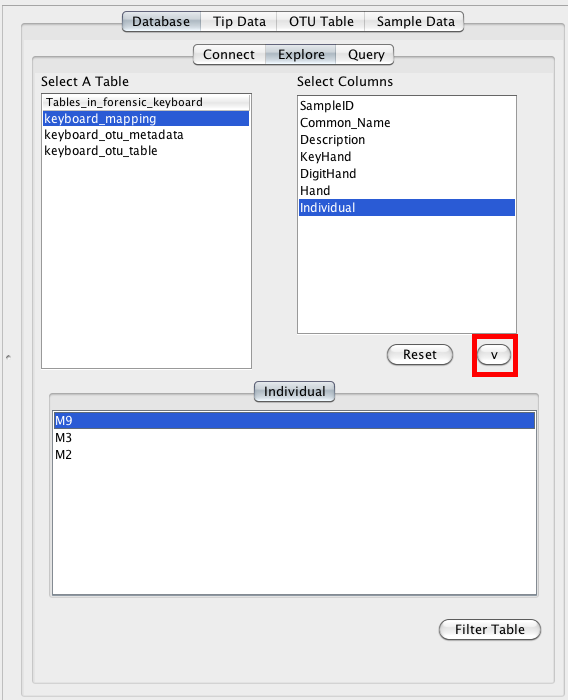
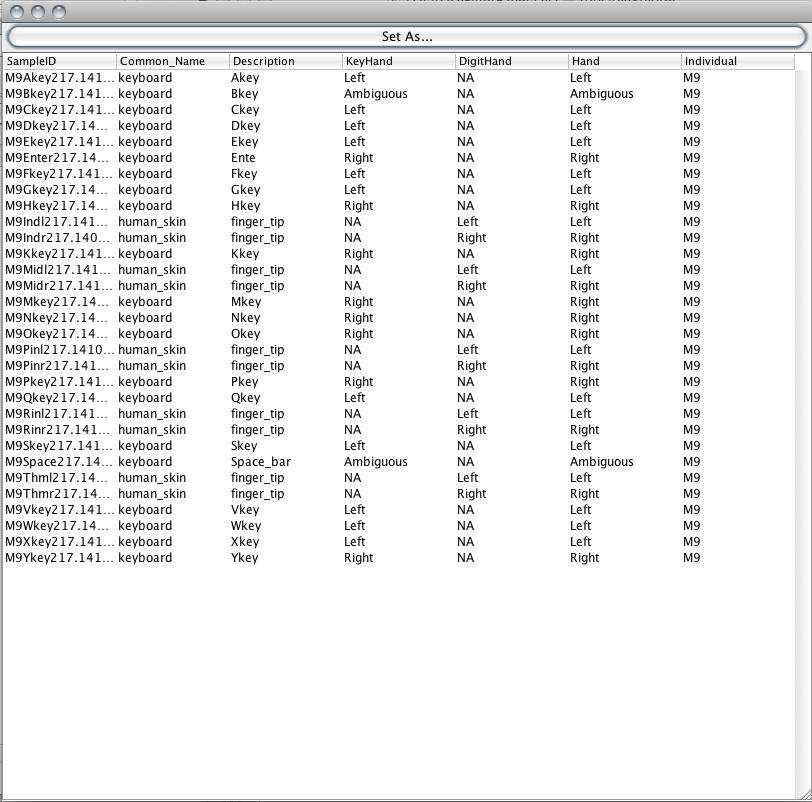
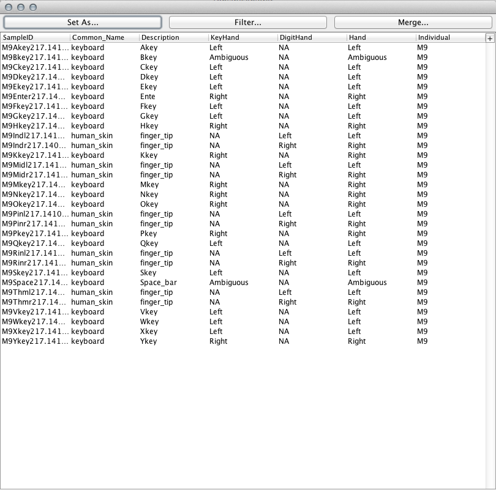
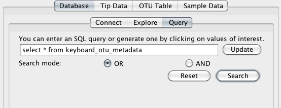
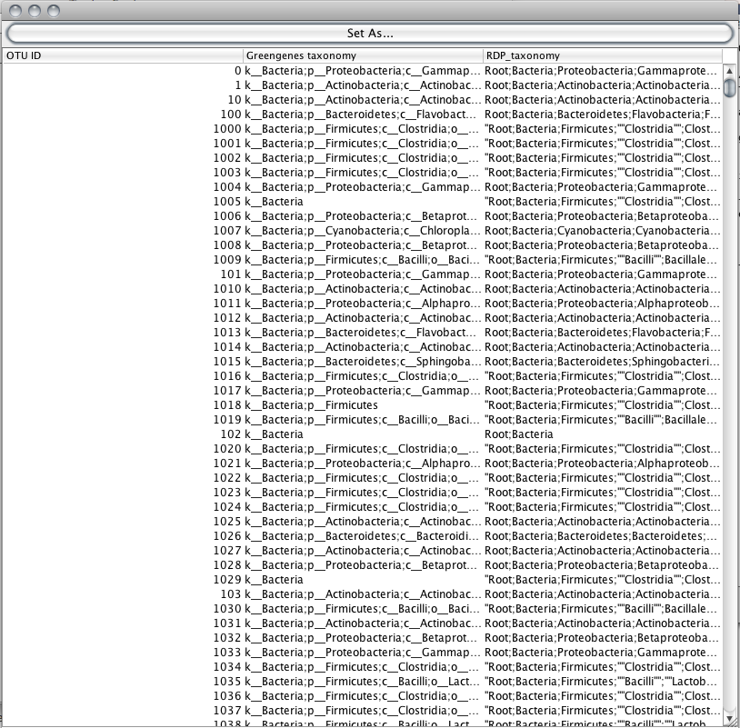
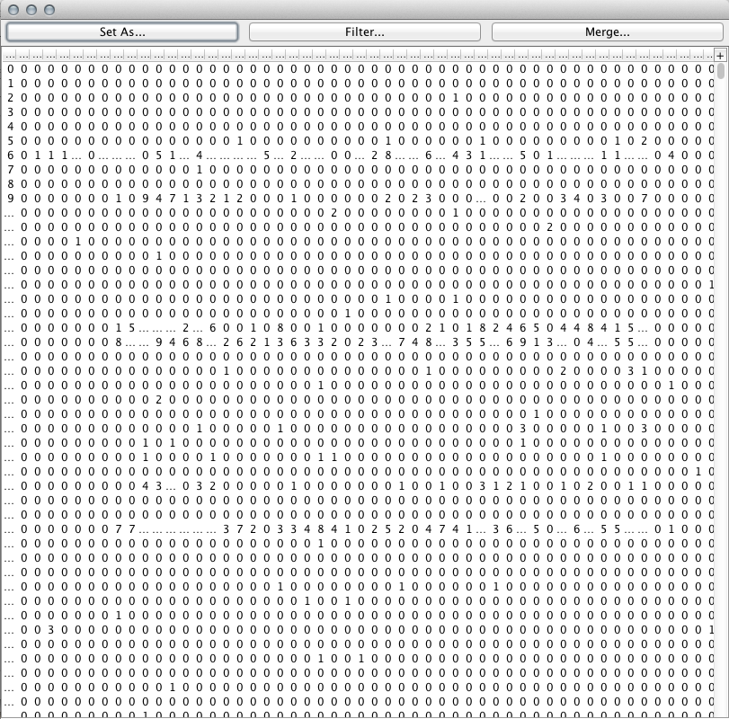
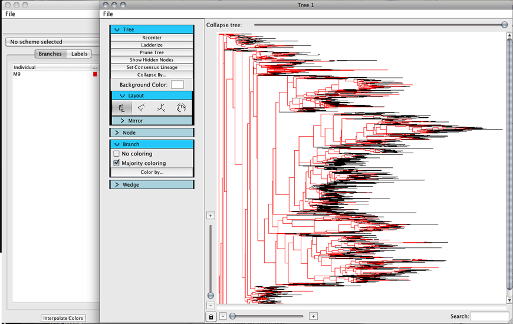

.. _database_connectivity:

******************************
Database connectivity tutorial
******************************
This tutorial shows how to load data from a locally running mysql database into TopiaryExplorer to  pull tip Data, OTU table, or sample data. 

Assumptions made in this tutorial
---------------------------------

 * Prior to working through this tutorial we recommend running through the `TopiaryExplorer Overview Tutorial <./quickstart.html>`_ which will show you how to work with the basic features of TopiaryExplorer. This tutorial assumes that you already know how to load the TopiaryExplorer application and that you have some familiarity with the basic interface.

 * You should also first review the `TopiaryExplorer Window <./topiaryexplorer_window.html>`_ guide, which covers the Database Pane.

 * You have a working mysql database on your system, with a user account already created. You can download the current version of MySQL here: http://dev.mysql.com/downloads/mysql/

Tutorial Input Files
--------------------
All of the files you need to complete this tutorial are packaged in the ``examples`` directory of the TopiaryExplorer package.

 * mysql Database Dump File (keyboard.sql): This is a mysql database dump that contains all of the tip data (keyboard_otu_metadata.txt), OTU abundance data (keyboard_otu_table.txt), and sample data (keyboard_mapping.txt) included in the ``examples`` directory and the `TopiaryExplorer Overview Tutorial <./quickstart.html>`_.

 * Newick-format tree (keyboard.tre): a tree in newick format with tip labels and branch lengths.

Step 1. Load the example database
---------------------------------
You'll first need to load the example data into your locally running mysql database. You can do this with the following command::

	mysql -uusername -ppassword < forensic_keyboard.sql
	
By default, the MySQL username will be root and the password will be whatever you chose at setup. 

Step 2. Load the tree
---------------------
Next, open TopiaryExplorer and load the tree file ``topiaryexplorer/examples/keyboard.tre``. This will open a new Tree Window. Switch back to the TopiaryExplorer Window.

Step 3. Connect to the local database
--------------------------------------
Fill in database connection information in the Connect dialog in the Database Pane. The relevant information is: Server: ``localhost``, Database: ``forensic_keyboard``, Username: ``root``, and your password will be system specific. 

.. figure::  _images/connect_to_database.png
   :align:   center

Once you've filled in the details, click the ``Connect`` button on the bottom right. This will take you to the database explore tab.

.. figure::  _images/all_tables_view.png
   :align:   center

Step 4. Select the the data that you'd like to use
--------------------------------------------------
You'll next select the type of data that you'd like to load from the database. The ``Tables_in_forensic_keyboard`` column lists the tables that are available in the database. Select the ``keyboard_mapping`` option.

.. figure::  _images/show_table.png
   :align:   center

Once you click a table, the column on the right will auto-populate with headers from the selected table. You can use the values in these headers to filter the table and get only relevant metadata. Click the Individual header item and then add it to the filters panel by clicking the "v" button.

Then click the filter table button and a table containing only relevant rows from the metadata will be displayed.

Step 5. Set the selected database table as the Sample Data
----------------------------------------------------------
Next click the ``Set As...`` button. A new window will open. Select ``Sample Data`` from the dropdown box and click ``OK``. This will set the ``keyboard_mapping`` table as the ``Sample Data`` in the TopiaryExplorer window, and will open the ``Sample Data`` tab. 

Step 6. Set the Tip data table
------------------------------
To set the Tip data, click on the ``Query`` tab at the top of the database tab pane. Type the query ``select * from keyboard_otu_metadata``, then click the search button.

Set the resulting table as the Tip data using the ``Set As...`` button.

Step 7. Set the OTU Table data
------------------------------
To set the OTU table data, click on the ``Query`` tab at the top of the database tab pane. Type the query ``select * from keyboard_otu_table``.
Set the resulting table as the OTU Table using the ``Set As...`` button.

Step 8. Color tree using Tip Data
---------------------------------

Next switch to the Tree Window. Uncollapse the tree by dragging the slider on top to the right. Color the branches in the tree by expanding the branch panel on the left, clicking ``Color by`` and then ``Sample Metadata`` and ``Individual``. Then switch to the TopiaryExplorer window and select colors for the different individuals. Switch back to the TreeWindow and your tree will now be colored by individual. 

.. note::
   You'll notice that the only individual that shows up is ``M9`` since we filtered the sample metadata table in step 4. 22% of the lineages present in the tree are found in individual M9.

This last step was covered very quickly here: if you got lost you should refer to the `TopiaryExplorer Overview Tutorial <./quickstart.html>`_ which goes through the steps for coloring a tree in a lot more detail.
