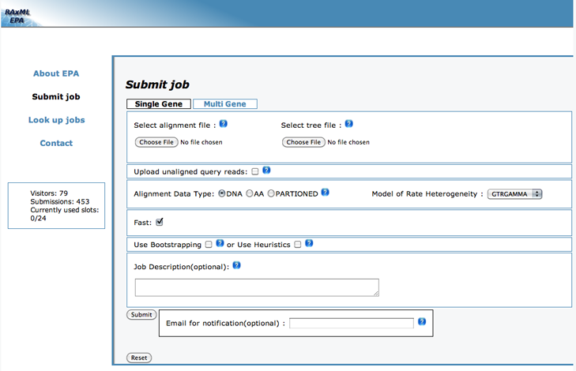
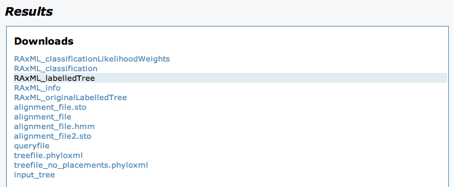
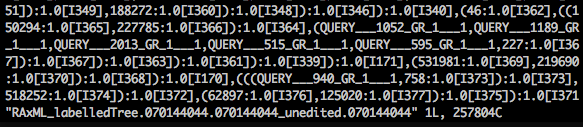
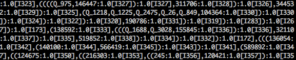
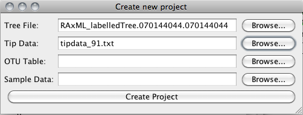
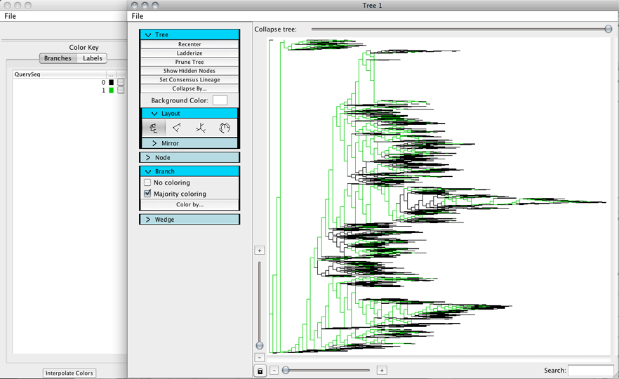
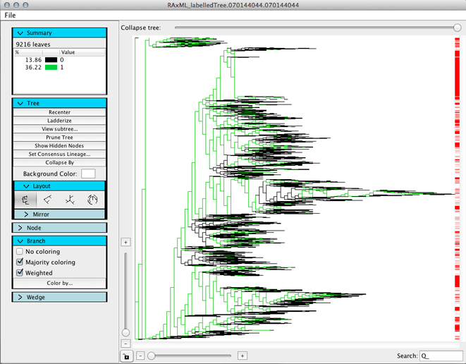

.. _insertion_tutorial:

***************************
Sequence insertion tutorial
***************************
This tutorial explains how to insert query sequences into a base tree and then color the tree so that the query sequences are easily visible.

Assumptions made in this tutorial
---------------------------------

 * Prior to working through this tutorial we recommend running through the `TopiaryExplorer Overview Tutorial <./quickstart.html>`_ which will show you how to work with the basic features of TopiaryExplorer. This tutorial assumes that you already know how to load the TopiaryExplorer application and that you have some familiarity with the basic interface.

Required Files
--------------
   * Aligned reference sequences
   * Reference tree
   * Query sequences

Step 1. Insert query sequences
------------------------------
Go to the `RAxML EPA online service <http://i12k-exelixis3.informatik.tu-muenchen.de/raxml/submit_single_gene>`_, you should see a page that looks like this:

Upload the correct files and enter an email address if desired. In this example we're inserting sequences from the keyboard analysis into a Greengenes reference tree. You can find the reference tree and alignment `here <http://greengenes.lbl.gov/Download/Sequence_Data/Fasta_data_files/Caporaso_Reference_OTUs/gg_otus_4feb2011.tgz>`_. You can find the aligned sequences being inserted into this tree as ``keyboard_aligned_rep_seqs.fasta.zip`` in the TopiaryExplorer examples directory. (You'll need to unzip the aligned sequences before uploading to the RAxML web server.)

.. figure::  _images/raxml_online_upload.png
   :align:   center

The output from the RAxML online service will look like this:

Save the file called `RAxML_labelledTree.########.########`

Step 2. Modify output tree labels
---------------------------------
Do a find/replace on the tree and replace instances of ``QUERY___`` with ``Q_`` and instances of ``_GR_1___1`` with nothing in order to make the IDs more readable.

This can be done in a text editor or on the command line with the following command, replacing ``old.tre`` and ``new.tre`` with the file names of the tree downloaded in Step 1, and desired name of the output tree, respectively::

	sed -e 's/QUERY___/Q_/g' -e 's/_GR_1___1//g' old.tre > new.tre

   
   Unmodified newick string

   Modified newick string

Step 3. Create tip data
-----------------------
Create a tip data file that contains both reference IDs and query IDs. This can be done with the following commands, replacing ``query.fna`` and ``refseqs.fna`` with the names of the inserted sequences fasta file and the reference sequences (or sequences in original tree), respectively::

	echo "#OTU ID<tab>Query" >> otu_metadata.txt
	grep -Eo '^>\w+' query.fna | grep -Eo '\w+' | sed -e 's/.*/Q_&<tab>1/' >> otu_metadata.txt
	grep -Eo '^>\w+' refseqs.fna | grep -Eo '\w+' | sed -e 's/.*/&<tab>0/' >> otu_metadata.txt

.. warning:: Do not type ``<tab>`` in the above commands, but replace these with a literal tab. To do this enter type Control-v followed by the tab key. This will show up as one or more spaces.

Step 4. Create a new project
----------------------------
Create a new project in TopiaryExplorer using your new tree and tip data file.

Step 5. Color the tree
----------------------
Color by the column corresponding to whether or not an ID was a query ID or not that you created in step 3.

You can also highlight the query sequences using the search function. Type ``Q_`` into the search box, and you will see all of the inserted sequences highlighted.

