.. _quickstart:

*******************
Quickstart Tutorial
*******************
This quick start tutorial is a task-oriented example showing the shortest path to a dynamically colored tree that can be explored, manipulated, and exported as a PDF.

This tutorial uses a tree and metadata derived from a reanalysis of the data from `"Forensic identification using skin bacterial communities" (Fierer et al., 2010 PNAS) <http://www.ncbi.nlm.nih.gov/pubmed/20231444>`_. Basic data analysis was performed in May of 2011 using `QIIME <http://www.qiime.org>`_. The Fierer PNAS paper showed that microbial communities on an individual's keyboard are more similar to the microbial communities on their hands than on the hand's of other individuals, opening the door to potential forensic applications for microbial community profiling. In this study microbial communities were sequenced from the finger tips of three individuals and the keys on their keyboards, and it is these data that we'll focus on for this application. Here we'll visualize the distribution of the sequence observations from one individual's keyboard on a phylogenetic tree constructed from representatives of all 16S sequences obtain in this study, learn how to decorate the tree with (pre-existing) taxonomic assignments, prune subtrees from the tree, and export the trees as PDFs for use in publications.

Tutorial Input Files
--------------------
All of the files you need to complete this tutorial are packaged in the ``examples`` directory of the TopiaryExplorer package.

The TopiaryExplorer project file (.tep)
^^^^^^^^^^^^^^^^^^^^^^^^^^^^^^^^^^^^^^^
The ``examples/keyboard.tep`` file is a Topiary Explorer Project file (.tep) created for use in this tutorial. The tree and all related metadata is stored in this file. We'll use this file in the tutorial.

.tep files are composites of the other files packaged in the TopiaryExplorer project directory. You'll typically start by loading these files independently possibly saving them as a single .tep file to facilitate project management and sharing of data. These independent files are:

 * Newick-format tree (keyboard.tre): a tree in newick_ format with tip labels and branch lengths.
 * tip metadata (keyboard_tip_metadata.txt): metadata associated with tips (e.g., taxonomic assignments). This file is not necessary if the user only wishes to color by sample/environmental metadata. If you're working with QIIME, this file can be generated by adding column headers to the output of `assign_taxonomy.py <http://qiime.org/scripts/assign_taxonomy.html>`_.
 * Tip abundance matrix (keyboard_otu_table.txt): a matrix mapping tips to their abundance in one or more samples. This file can be generated by the user in Excel (save as tab-delimited text) or by the `make_otu_table.py <http://qiime.org/scripts/make_otu_table.html>`_ script in QIIME. This is a `QIIME-compatible OTU table <http://qiime.org/documentation/file_formats.html#otu-table>`_. This file is not needed if the user only wishes to color by tip metadata.
 * Sample/environment data (keyboard_mapping.txt): a matrix mapping samples/environments to data about those environments. This file can be generated by the user in Excel (save as tab-delimited text) and is a `QIIME-compatible mapping file <http://qiime.org/documentation/file_formats.html#metadata-mapping-files>`_.

Step 0. Installing TopiaryExplorer
----------------------------------

If you haven't yet installed TopiaryExplorer, start on the `Topiary Explorer install page <./install.html>`_. This tutorial specifically covers working with the release version of TopiaryExplorer.

Step 1. Running TopiaryExplorer
-------------------------------
Navigate to the unpacked topiaryexplorer directory from the command line.

Run with the command TopiaryExplorer::
	
	javaws topiaryexplorer.jnlp

When successfully run, you should get a window that looks like the following.

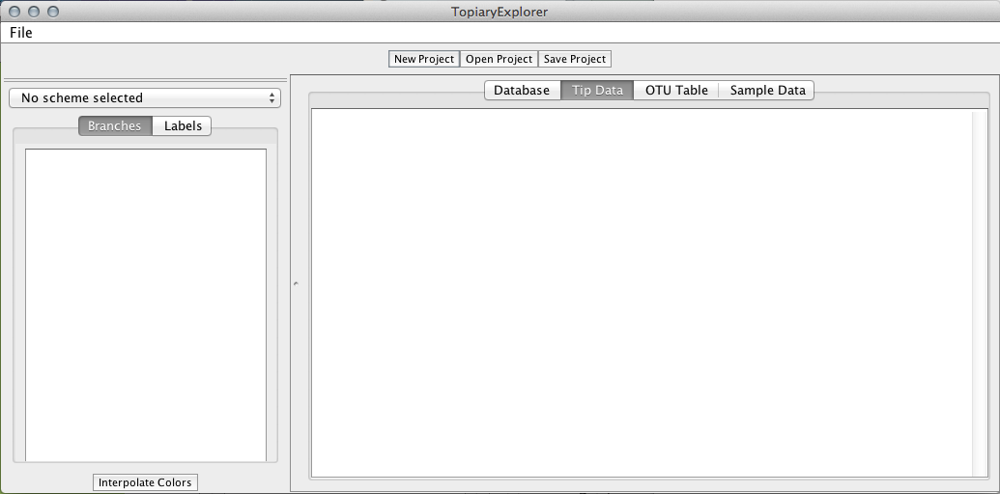

   A newly opened TopiaryExplorer window.

Step 2. Opening the .tep file
-----------------------------
Using the Open Project button located at the top of the TopiaryExplorer window, navigate to the ``examples`` folder containing :file:`keyboard.tep` and open the file. Two new windows will open, and will look like the following. These will be referred to as the "Tree window" and the "Topiary Explorer window", respectively.

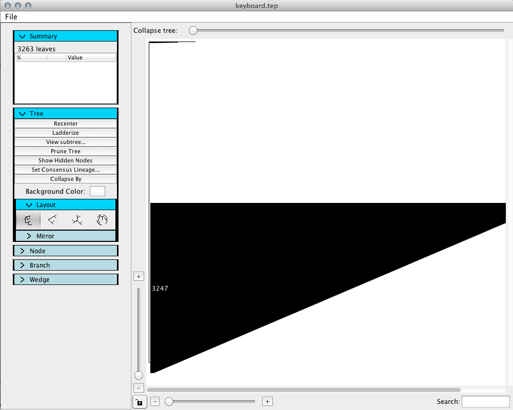

   "Tree window" upon opening keyboard.tep.

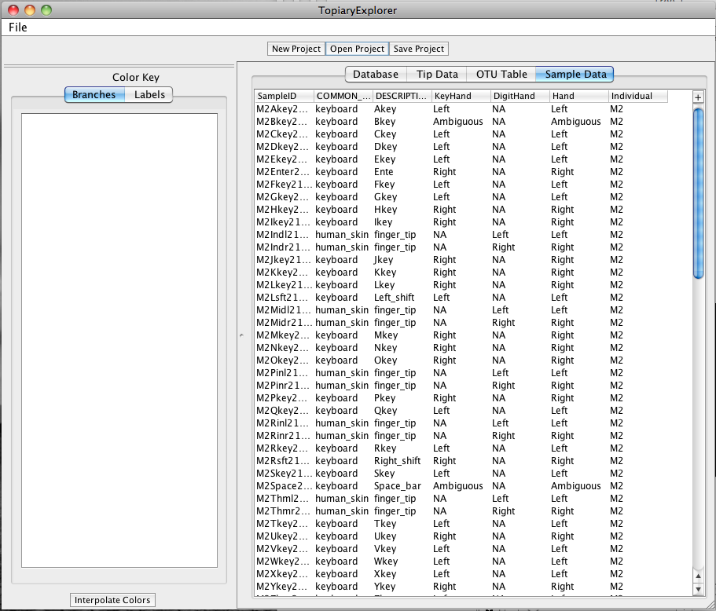

   "Topiary Explorer window" upon opening keyboard.tep

Step 3. Uncollapsing the tree
-----------------------------
Drag the "Collapse tree" slider at the top of the new Tree Window to the right to fully uncollapse the tree.

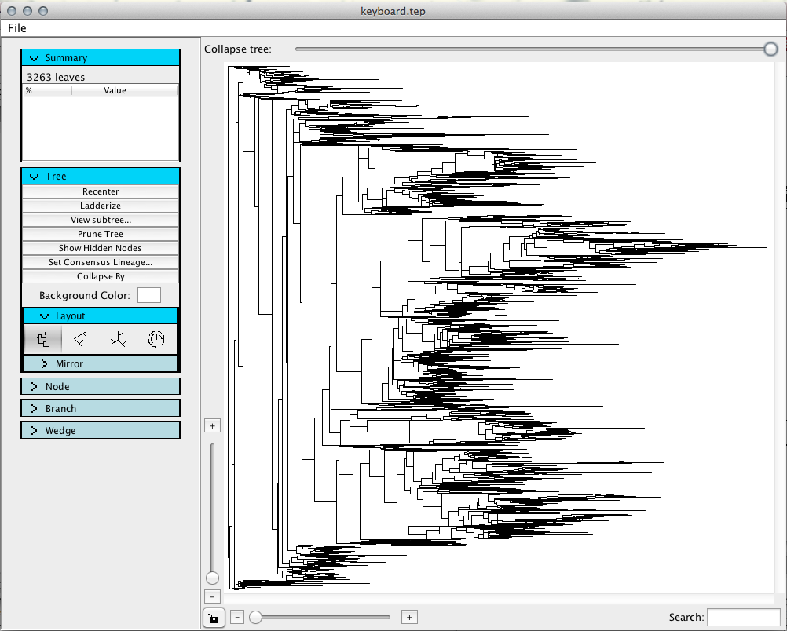

   Tree window after dragging the "Collapse tree" slider to the right.

Step 4. Editing & saving metadata
---------------------------------
In the Topiary Explorer window, you will find a ``+`` button in the top right corner of the metadata table (this button is ``...`` on Windows). This button allows you to add new columns to a table or to save a table as tab delimited text.

In the "Sample Data" tab, add a new column by clicking the ``+`` button. Name the new column ``IndividualKeyHand`` by typing this in the text field. Then click the ``Combine`` button. Select both the ``KeyHand`` and ``Individual`` options in the text window by holding the "Command" key (on OS X) or the "Control" key (on Windows). Click ``Add`` to add the new column. Now if you scroll to the right in the Topiary Explorer window you will see this new column on the right end.

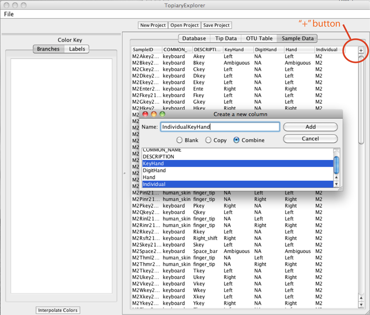

   Add column dialog with the ``+`` button highlighted.

For the keyboard samples, the ``KeyHand`` column of the sample data describes the hand that strikes the corresponding key (Left, Right, or Ambiguous, where Ambiguous refers to keys that may be hit with either hand such as the space bar). For the skin samples ``KeyHand`` contains ``NA``. The ``Individual`` column contains the subject identifier (e.g., ``M3`` refers to male subject number 3).

Step 5. Coloring the tree
-------------------------
Next we'll use this new metadata field to color the tree's branches. Move back to the Tree Window and expand the ``Branch`` panel by clicking the word ``Branch`` in the toolbar on the left (which we'll refer to as the ``Tree Toolbar``). Click the "Color By..." button, then select ``Sample Metadata``, and select the new metadata category, ``IndividualKeyHand``. 

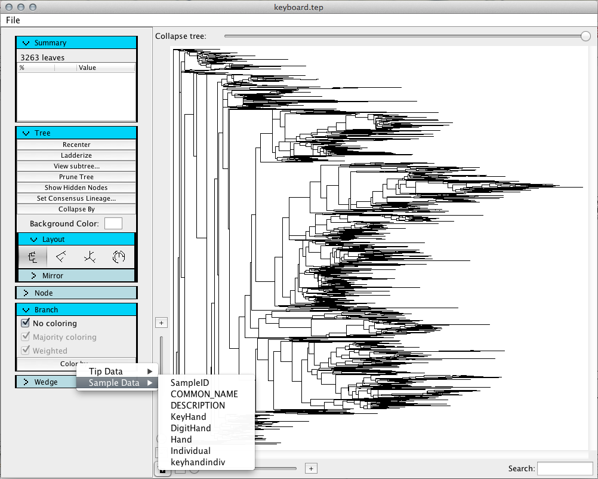

   Dialog to color by metadata.

By default each option for the category will be colored gray. To change this, switch to the Topiary Explorer window. The Color Key toolbar on the left is used to choose colors on a per-category basis. To change the color for a given value click the small grey box, which will open a the "Pick a Color" window. Choose blue for the RightM3, LeftM3, and AmbiguousM3 values.

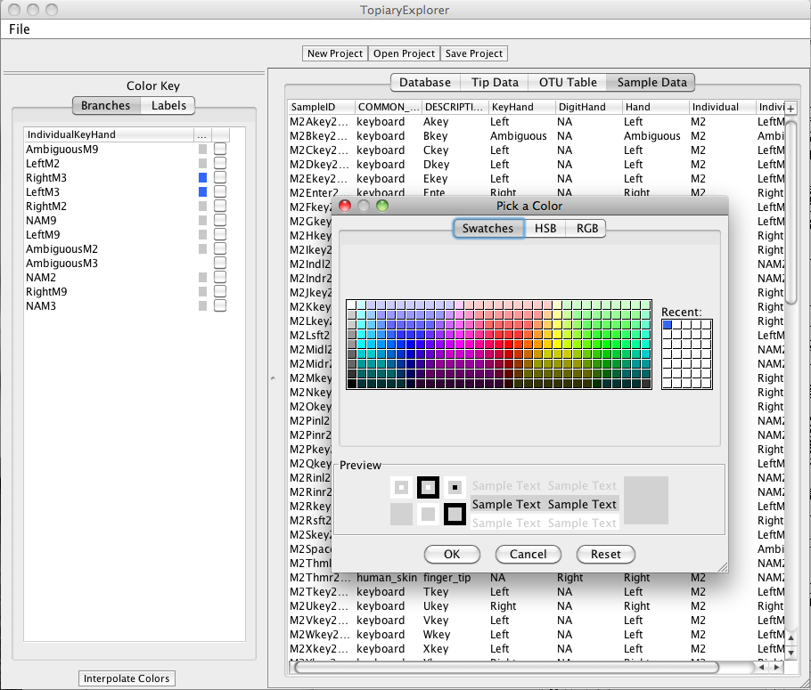

   Dialog to choose colors for metadata.

Switch back to the Topiary Explorer window and uncheck the "Majority coloring" checkbox. Your tree should look like the one pictured here.

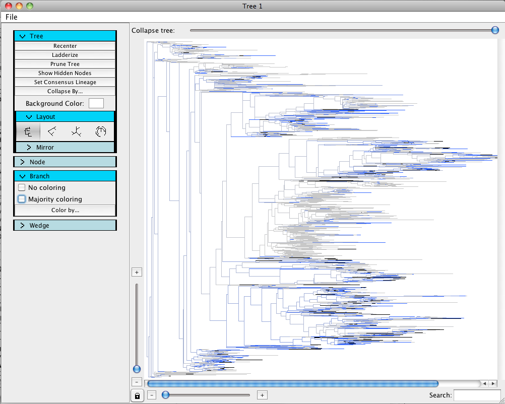

   Tree with M3 keys colored.

Step 6. Set consensus lineages and collapse branches in the tree.
-----------------------------------------------------------------
Now we'll add consensus lineages to the tree and collapse some of the branches into wedges. In the Tree window, click the "Set Consensus Lineage" button. In the "Choose Threshold" window, select "Greengenes Taxonomy" in the "Taxonomy Column" dropdown box and "70%" in the "Choose options..." dropdown box. This indicates that you want to use the Greengenes taxonomy to label taxonomy to the tips in the tree, and that you want to label wedges only when the taxonomy string represents at least 70% of the tips descending from that node. 

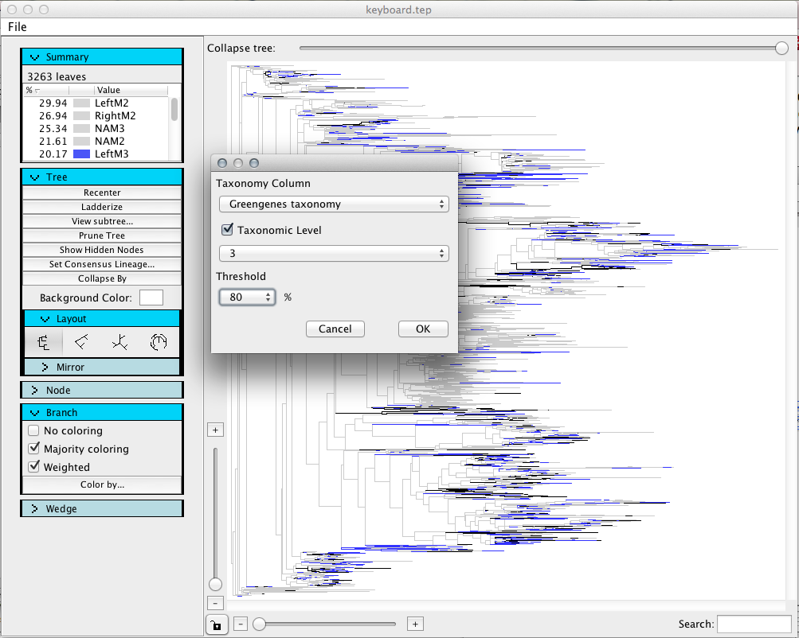

   Set the consensus lineage for nodes on the tree.

Next click the "Collapse tree" slider bar and slide to the left. You'll notice that branches collapse into wedges when the slider passes the root of their clade. The coloring of the wedge will be determined by the percentage of the tips represented by that wedge which are blue (i.e., associated with M3 in this example).

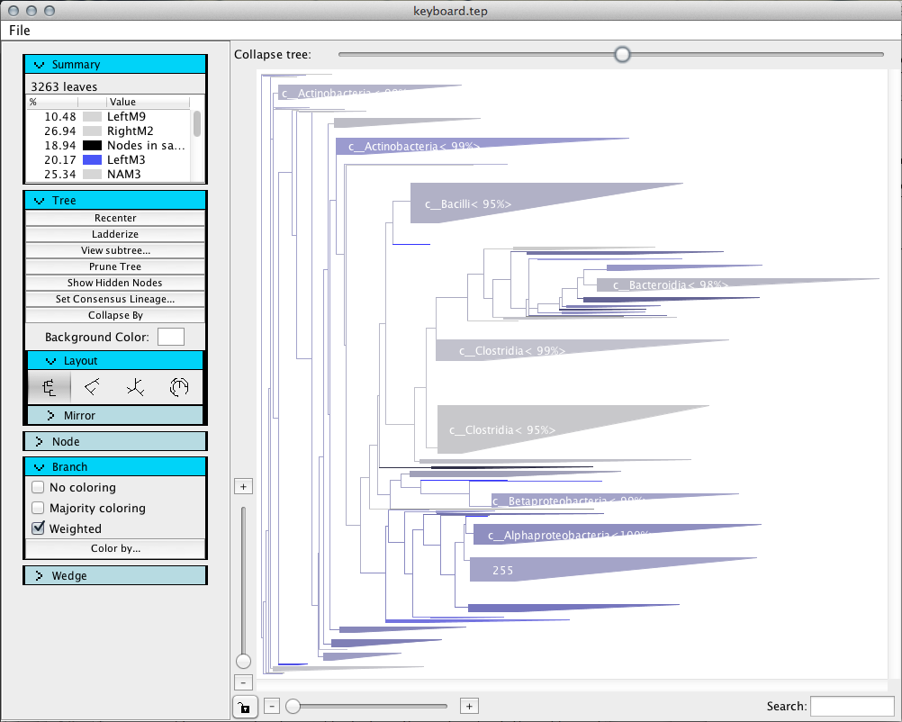

   Collapsed tree with consensus lineages.

You can change the font or font size for the wedge labels by expanding the "Wedge" menu in the Tree Toolbar of the Tree Window.

Step 7. Export tree as PDF.
---------------------------
To save this view of the tree as a PDF, choose 'File > Export Tree Image' in the Topiary Explorer window. Type a name for the tree in the 'Save as...' field. The extension  ``.pdf`` will be automatically added. Just enter a file name - not a path. Click the Export button, and the PDF will be opened in your default PDF viewer. For there you can save the file to where ever you'd like in your file system. After clicking the Export button it may take several seconds before the resulting PDF is generated and opened.

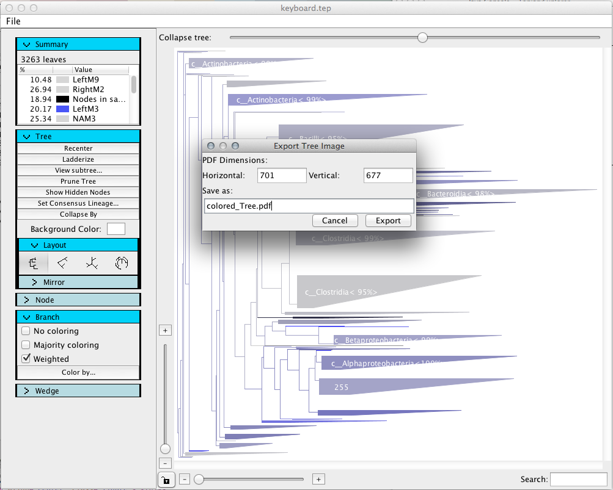

   Export tree as a PDF.

Step 8. Opening a subtree.
--------------------------
In order to study the tree more carefully, you may want to focus on smaller subtrees of a larger tree.

To view a subtree more closely, right click on the root node of the subtree of interest and then click View Subtree in new Window.

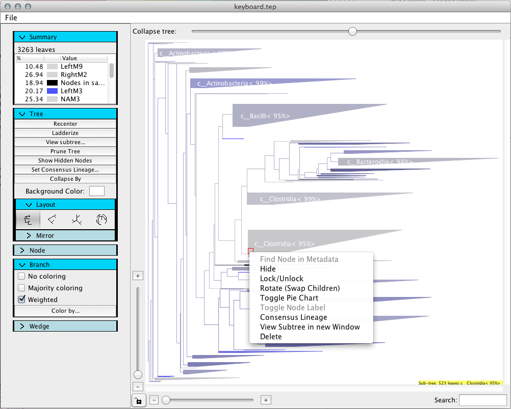

   Choose the subtree to view in a new window.

Step 9. Prune the tree.
-------------------------
To remove unwanted branches, use the prune tree button at the top of the Tree Toolbar.

In the subtree window, we are going to remove branches based on sample metadata. Click the "Prune tree" button, then select the "Metadata" button, followed by the "Sample Metadata" button. In the dropdown box select the "IndividualKeyHand" value, and then select the three categories associated beginning with "NA" as shown in the image below. 

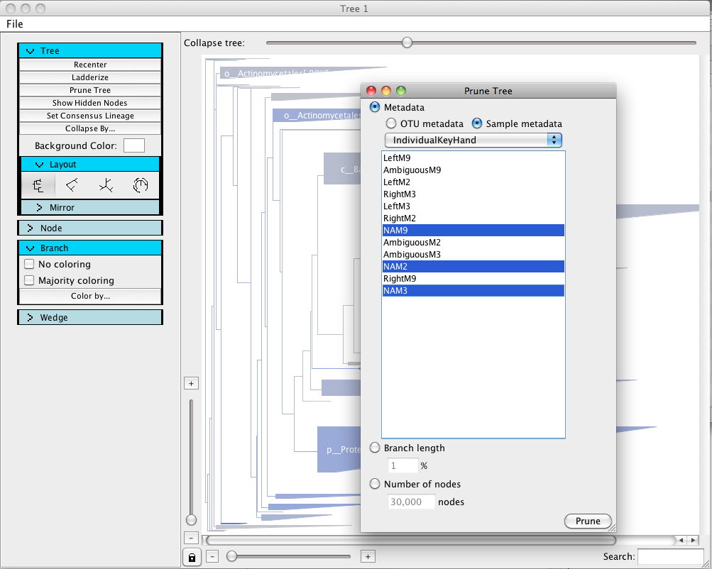

   Prune dialog box.

Click the "Prune" button in the bottom right of this window to prune the tips associated with the "NA" samples (i.e., the skin samples as opposed to the keyboard samples) from the tree. The resulting tree should look like this:

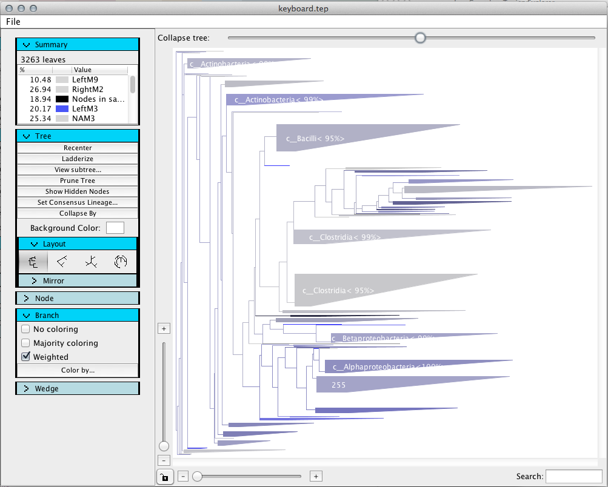

   Pruned tree.

Step 10. Saving a new project.
------------------------------
To save your modified metadata and trees, click the Save Project button at the top of the Topiary Explorer window. This will create a new .tep file that will allow you to pick up where you've left off.

.. _newick: http://en.wikipedia.org/wiki/Newick_format
.. _QIIME: http://qiime.org
