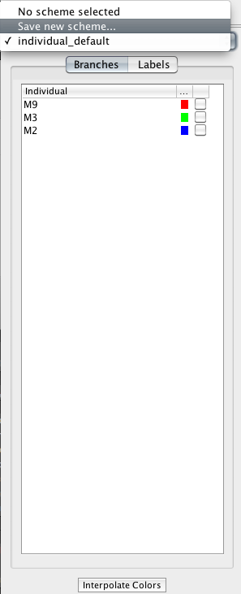
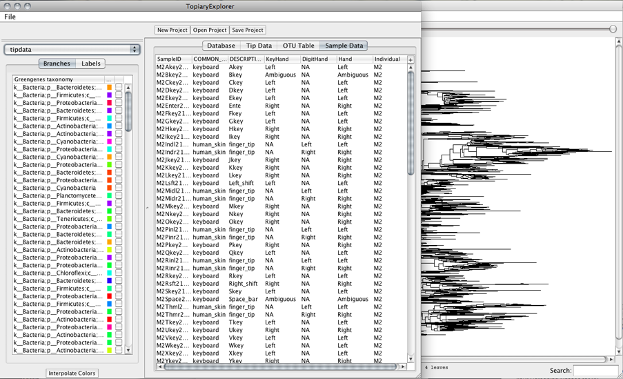
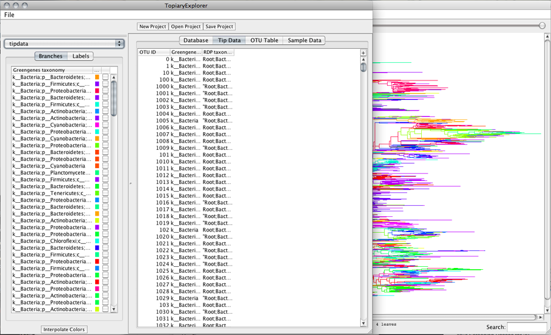

.. _scheme_tutorial:

*********************
Color scheme tutorial
*********************
This tutorial discusses how to add and apply color schemes to a tree. Being able to save and re-apply color schemes is useful for data exploration.

Assumptions made in this tutorial
---------------------------------

* Prior to working through this tutorial we recommend running through the `TopiaryExplorer Overview Tutorial <./quickstart.html>`_ which will show you how to work with the basic features of TopiaryExplorer. This tutorial assumes that you already know how to load the TopiaryExplorer application and that you have some familiarity with the basic interface.

Step 1. Load the tree and related metadata
------------------------------------------
Use the open project button or the file menu to load the tree and its related metadata. For color schemes you may not need to load files corresponding to all tables. If your metadata unique IDs are the same as the names of the tips on your tree, you need only load that data as **Tip Metadata**. If the tips on your tree correspond to OTUs and you have metadata corresponding to sample IDs that are linked to OTUs through an OTU table, you need to load both the OTU table and the metadata as **Sample Metadata**.

.. note::
   The names of the tables can sometimes be confusing, remember that the metadata that goes in the **Tip Metadata** table corresponds directly to the tip names included in the tree Newick string.

Step 2. Save new color scheme
-----------------------------
Color the tree based on some metadata using the colorby menu in either the branch or label panel. To save a scheme, select the "Save new scheme..." option from the drowdown menu located at the top of the ColorKey toolbar.

Step 3. Load a saved color scheme
---------------------------------
Once you have changed the current colors or even colored by a different category, you can return to a previous color scheme using the color scheme dropdown menu. 

.. note:: 
   **IMPORTANT**  Since some trees have tips that are OTU ids and other trees have tips that are Sample IDs, you have to have the correct table selected in the mainframe when loading a scheme.

   Loading a scheme that corresponds to Tip data with the Sample Data tab selected will result in a non colored tree.

   Loading a scheme with the proper table tab selected.

.. note:: 
   You can load saved color schemes for both branches and labels, whichever tab is selected in the ColorKey toolbar will load the colors of the selected scheme.