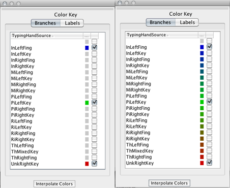
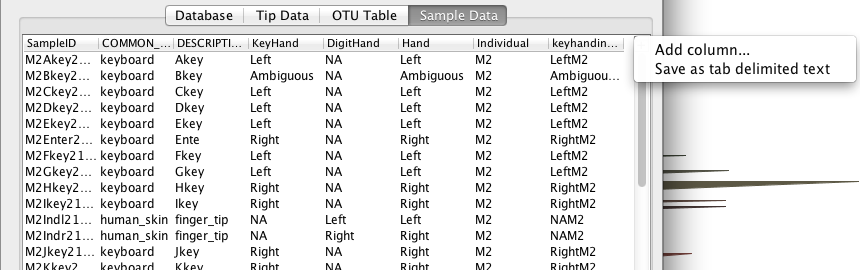
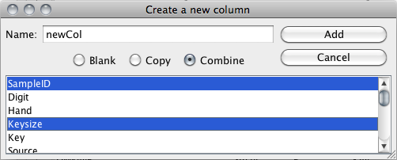

.. _topiaryexplorer_window:

**********************
TopiaryExplorer Window
**********************
This guide explains all of the functions that a user can perform using the TopiaryExplorer window.

The TopiaryExplorer window contains the following elements:

  *  The file menu
  *  The project management buttons
  *  The color key toolbar
  *  The data table tab pane

.. figure::  _images/blank.png
   :align:   center

File menu
=========
The file menu contains functions for creating, opening and saving projects. You can also load individual tree and metadata files using this menu.

The project management buttons mirror the functionality found in the file menu.

New project
-----------
To create a new project with a tree and some related metadata, use the new project menu item or button.

.. figure::  _images/new_project.png
   :align:   center

.. note:: All file fields are not required to create a new project, but to color a tree, a user must have at least a tree and OTU metadata table OR a tree, OTU table and sample mapping.

Open project
------------
To open a previously saved project, use the open project file item or button.

Save project
------------
Saving a project will create a .tep (TopiaryExplorer Project) file containing all open tree windows and loaded metadata tables.

Load tree
---------
Use this file item to load an individual tree or to load a new tree once a project has been created.

Load OTU metadata/ Load OTU Abundance Table/ Load Sample Metadata Mapping
-------------------------------------------------------------------------
These menu items allow you do individually load the different tables, or to replace a table that has already been loaded.

Load Data Table
---------------
This menu item allows you to open an arbitrary tab-delimited text file. You can learn more about the `Datatable Window <./data_table.html>`_ in the `Interface Guide <./interface_guide.html>`_.

The color key toolbar
=====================
The color key toolbar is used to define the colors of fields by which branches or node labels are to be colored by.

This toolbar contains:

  *  The branch coloring pane
  *  The label coloring pane
  *  The interpolate button

.. note:: By clicking on the "Color Key" text and dragging, the color key toolbar can be moved from the TopiaryExplorer window and placed elsewhere.

.. note:: The fields in the color key toolbar are sortable. Click on the column header to sort the fields.

Branch coloring pane/ Label coloring pane
-----------------------------------------
Both of these panes of the color key toolbar have identical functionality except that the colors and fields in them correspond to their respective parts of the tree.

Interpolate button
------------------
The interpolate button is used to create a gradient which interpolates across selected colors in the color key toolbar.

Data table tab pane
===================
The data table tab pane contains tables for each of the data files that can be used in TopiaryExplorer. An example of using this functionality is covered in the `database connectivity tutorial <./database_connectivity.html>`_.

These panes are:

  *  The database pane
  *  The OTU metadata pane
  *  The OTU abundance table pane
  *  The sample metadata mapping pane

Database pane
-------------
The database pane is used to connect to external databases and pull down information to be used in the data tables. To connect to a database, enter the database information into the dialog.

.. figure:: _images/connect_to_database.png
   :align:	center

Once you are connected to the database, the dialog will be disabled and you will be able to navigate to different tables in the database.

.. figure:: _images/show_table.png
   :align: center

Visit the database connectivity tutorial for more detailed information.

OTU metadata pane/ OTU abundance table pane/ Sample metadata mapping pane
-------------------------------------------------------------------------
Each of these panes contains a table with information loaded from either a tab delimited text file, .tep project file or database table.

The elements of a data table pane are:

  *  The data table options button
  *  The data table

.. note:: Datatable fields are individually editable.

Data table options button
-------------------------
The data table options button is located at the top right corner of each data table pane.

This button contains two functions:

  *  Add new column
  *  Save as tab delimited text

Add new column
--------------
Adding new columns to a datatable is simple. You can either create a blank column, a column whose fields are a copy of an existing column, or a new column whose fields are a combination of fields from existing columns.

.. note:: Combination columns can be made up of two or more existing column fields.

