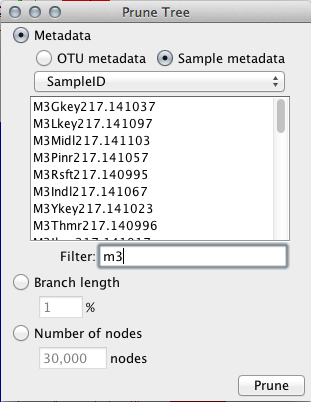
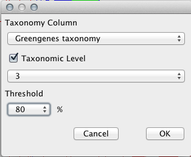

.. _tree_panel:

**********
Tree Panel
**********
The tree panel controls functions and layout related to whole tree. 

.. figure::  _images/tree_panel.png
   :align:   center

This panel is used to:
  
  *  Recenter the tree
  *  Ladderize the tree
  *  View a subtree
  *  Prune the tree
  *  Show hidden nodes
  *  Set consensus lineage
  *  Collapse the tree by metadata
  *  Change the background color of the tree
  *  Set the color & transparency of unmapped nodes
  *  Change the tree layout
  *  Rotate the tree
  *  Mirror the tree

Recenter
--------
The recenter button fits the tree to the current window size.

Ladderize
---------
The ladderize button sorts the branches of the tree based on length.

View Subtree
------------
The view subtree button opens a dialog which provides functionality for opening a subtree around a node matching some string.

.. figure::  _images/subtree_dialog.png
   :align:   center

Prune
-----
The prune button opens a dialog which offers a few different options for pruning the tree.

Pruning the tree based on metadata can be done using either OTU or sample metadata. If you choose to prune based on OTU metadata, each OTU which matches the values that you have selected will be pruned. If you choose to prune based on sample metadata, each OTU found in a sample that matches at least one of the values selected will be pruned. Clades that contain only pruned tips after the initial pruning step are also pruned.

You can filter the available fields using a string.

Pruning the tree by branch length takes an integer value between 0 and 100, and will then prune all branches with length less than the selected percent of total branch length.

.. figure::  _images/prune_branch_length.png
   :align:   center

Pruning the tree by number of nodes takes an integer value smaller than the size of the current tree. Then, starting with a threshold of 1%, branches with length less than the threshold percent of total length are pruned. This step is performed iteratively with increasing threshold until a tree with less or equal to the selected number of nodes is found.

.. figure::  _images/prune_number_nodes.png
   :align:   center

Show hidden nodes
-----------------
Nodes can be hidden using the context menu shown when right clicking on a node. The show hidden nodes button in the tree toolbar will reveal all hidden nodes.

.. _Consensus Lineage:

Set consensus lineage
---------------------
The user will be prompted to choose a column from the OTU metadata table that contains full lineages, an optional level-wise consensus and a threshold level for cutoff. In order for a lineage to be assigned to a wedge, at least the threshold percentage of tips in that wedge must have that lineage.

.. note:: Consensus lineage should be re-set once a tree is pruned for accurate display.

Collapse by
-----------
Nodes can be collapsed by some OTU metadata value, with some supplied threshold. Once `Consensus Lineage`_ has been set, you can also collapse by those values. 

Unmapped node color
-------------------
This color box lets you change the color of branches in the tree that are not covered by the supplied metadata. You can also use the slider to control the transparency of these nodes.

Layout
------
There are four tree layouts currently available, listed in order of their appearance in the Layout subpanel:

  *  Rectangular
  *  Triangular
  *  Radial
  *  Polar

.. figure::  _images/layout.png
   :align:   center

.. note:: In the triangular view you may notice crossed lines. This is an unavoidable issue with this view as noted by Joe Felsenstein in Inferring Phylogenies: "crossed lines [are] an unfortunate effect that cannot always be avoided." (page 576 with illustration of the exact issue on page 577)

.. note:: Rotation is only available in radial and polar views.

.. note:: Collapsing is not available in the polar view.