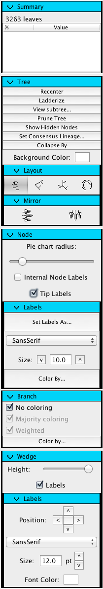
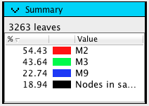

.. _tree_toolbar:

************
Tree Toolbar
************
This guide explains all of the functions that a user can perform on a tree using the tree toolbar.

Summary Panel
=============
The summary panel gives you an overview of the tree. It shows the number of leaves in the current tree as well as the percent of branches covered by different categories when the tree is colored. In this example, 54% of the lineages in the tree were found in individual M2, 43% in M3, 22% in M9 and 18% of the lineages were found in individuals not included in the metadata.

.. note:: Lineages are likely found in more than one sample, so the percentages in the table will not add up to 100%.

Tree Panel
==========
The tree panel controls functions and layout related to whole tree. 

This panel is used to:
  
  *  Recenter the tree
  *  Ladderize the tree
  *  Prune the tree
  *  Show hidden nodes
  *  Set consensus lineage
  *  Collapse the tree by metadata
  *  Change the background color of the tree
  *  Change the tree layout
  *  Rotate the tree
  *  Mirror the tree

Recenter
--------
The recenter button brings the tree back to the original zoom level and x,y location.

Ladderize
---------
The ladderize button sorts the branches of the tree based on length.

Prune
-----
The prune button opens a dialog which offers a few different options for pruning the tree.

Pruning the tree based on metadata can be done using either OTU or sample metadata. If you choose to prune based on OTU metadata, each OTU which matches the values that you have selected will be pruned. If you choose to prune based on sample metadata, each OTU found in a sample that matches at least one of the values selected will be pruned. Clades that contain only pruned tips after the initial pruning step are also pruned.

You can filter the available fields using a string.

.. figure::  _images/prune_metadata.png
   :align:   center 

Pruning the tree by branch length takes an integer value between 0 and 100, and will then prune all branches with length less than the selected percent of total branch length.

.. figure::  _images/prune_branch_length.png
   :align:   center

Pruning the tree by number of nodes takes an integer value smaller than the size of the current tree. Then, starting with a threshold of 1%, branches with length less than the threshold percent of total length are pruned. This step is performed iteratively with increasing threshold until a tree with less or equal to the selected number of nodes is found.

.. figure::  _images/prune_number_nodes.png
   :align:   center

Show hidden nodes
-----------------
Nodes can be hidden using the context menu shown when right clicking on a node. The show hidden nodes button in the tree toolbar will reveal all hidden nodes.

.. _Consensus Lineage:

Set consensus lineage
---------------------
The user will be prompted to choose a column from the OTU metadata table that contains full lineages, an optional level-wise consensus and a threshold level for cutoff. In order for a lineage to be assigned to a wedge, at least the threshold percentage of tips in that wedge must have that lineage.

.. figure::  _images/consensus_lineage.png
   :align:   center

.. note:: Consensus lineage should be re-set once a tree is pruned for accurate display.

Collapse by
-----------
Nodes can be collapsed by some OTU metadata value, with some supplied threshold. Once `Consensus Lineage`_ has been set, you can also collapse by those values. 

Layout
------
There are four tree layouts currently available, listed in order of their appearance in the Layout subpanel:

  *  Rectangular
  *  Triangular
  *  Radial
  *  Polar

.. figure::  _images/layout.png
   :align:   center

.. note:: In the triangular view you may notice crossed lines. This is an unavoidable issue with this view as noted by Joe Felsenstein in Inferring Phylogenies: "crossed lines [are] an unfortunate effect that cannot always be avoided." (page 576 with illustration of the exact issue on page 577)

.. note:: Rotation is only available in radial and polar views.

.. note:: Collapsing is not available in the polar view.

Node Panel
==========
The node panel is the second panel on the tree toolbar.

This panel is used to:
  
  *  Turn on/off internal node labels
  *  Turn on/off tip labels
  *  Specify tip labels
  *  Change node label font
  *  Adjust node label size
  *  Color node labels by metadata

Turning on/off labels
---------------------
The program decides whether or not to draw labels as a function of zoom level and font size. Node labels will not show unless the view is zoomed in enough that the labels will not overlap.

.. note:: Labels may still overlap in radial and polar views at low zoom levels.

Set labels as
-------------
This button produces a dialog which allows the user to set the tip labels as some metadata field or combination of fields.

.. figure::  _images/set_tip_labels.png
   :align:   center

Color by
--------
All tree coloring functions are described in the Coloring Trees section of the tutorial.

Branch Panel
============
The branch panel is the third panel on the tree toolbar.

This panel is used to:

  *  Turn on/off branch coloring
  *  Turn on/off majority coloring
  *  Color branches by metadata

Majority Coloring
-----------------
When the majority coloring checkbox is selected, internal nodes will take on the color that appears most often in its tips. When unchecked, internal nodes will take on a color that is a combination of the colors of all of its tips.

.. figure::  _images/majority_coloring.png
   :align:   center

   A tree with majority coloring selected on top, the same tree with combination coloring on bottom.

Color by
--------
All tree coloring functions are described in the Coloring Trees section of the tutorial.

Wedge Panel
===========
The wedge panel is the last panel in the tree toolbar.

This panel is used to:

  *  Adjust the height of wedges
  *  Turn on/off wedge labels
  *  Adjust the position of wedge labels
  *  Change the wedge label font
  *  Adjust the wedge label size
  *  Change the wedge label color

Wedge height
------------
The wedge height slider will adjust the height of all wedges. This function is especially useful in radial view where some wedges may overlap.

