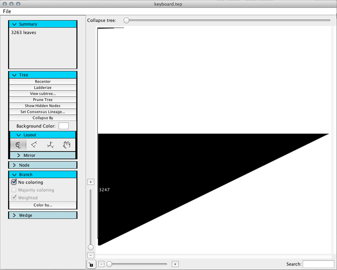
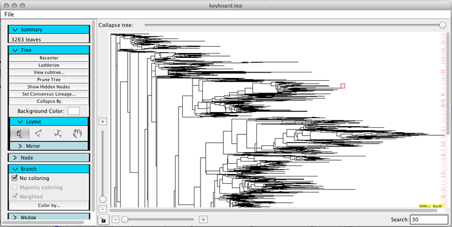

.. _tree_window:

***********
Tree Window
***********
This guide explains all of the functions that a user can perform on a tree using the tree window.

The tree window contains the following elements:

  *  Tree file menu
  *  `Tree toolbar <./tree_toolbar.html>`_
  *  Collapse tree toolbar
  *  Tree view
  *  Vertical zoom slider
  *  Horizontal zoom slider
  *  Zoom lock button
  *  Node search field

Tree file menu
==============
The file menu in the tree window provides the following functions:

  *  Save tree as newick string
  *  Export tree image as pdf
  *  Batch export tree images over metadata category
  *  Export tree screencapture

Export tree image
-----------------
This will export a pdf of the current tree view as a pdf. The file will be saved in your local TopiaryExplorer directory under "tree_export_images" and will attempt to open the file using your operating systems' specified pdf viewer.

Batch export tree images
----------------------
This function will export multiple views of the tree corresponding to the current coloring. Check out the `Batch Export Tutorial <./batch_tutorial.html>`_ for more information.

Collapse tree toolbar
=====================
The collapse tree toolbar is a slider corresponding to the collapse level of the tree. The bar represents 100% branch length, with 100% on the left and 0% on the right. When you drag the slider, branches whose branch length are less than the percent of branch length at the handle will be collapsed. For example, if the handle is in the middle, corresponding to 50%, branches that are less than 50% of the total branch length of the longest root to tip distance will be collapsed. By clicking on the button to the right of the collapse toolbar, you can change the mode between distance from root and distance from parent.

.. figure::  _images/collapse_toolbar.png
   :align:   center

.. note:: Collapsing is not available in the polar view.

Tree view
=========
The tree view holds the tree, and when focused, hovering over nodes will give more information about each node. You can also search for nodes matching a string; their location in the tree will be indicated by a red dash on the right side of the view with a semi transparent red line showing the exact position of a matched node.

Right clicking on a node in the tree view will give access to a context menu with different options that can be performed on the clicked node.

These options include:

  *  Find in metadata
  *  Hide
  *  Lock/Unlock
  *  Rotate
  *  Toggle pie chart
  *  Toggle node label
  *  Reset Node Label Position
  *  Consensus lineage
  *  View subtree in new window
  *  Export Tip Names with Groups...
  *  Delete
  
.. figure::  _images/tree_menu.png
   :align:   center

Find in metadata
----------------
This option will bring the Tip data table to the front with the selected node highlighted(if the node can be found in the metadata). 

Hide
----
Nodes can be hidden from view using this option. To reveal hidden nodes, use the Show Hidden Nodes button in the `Tree toolbar <./tree_toolbar.html>`_.

Lock/Unlock
-----------
Node collapse states can be locked/unlocked. When a node is locked, it will not respond to the collapse slider.

.. note:: Double clicking will also lock/unlock a node.

.. note:: Changing to polar view will uncollapse the entire tree, but node lock/unlock states are preserved so when the layout is changed the locked nodes are still locked.

Toggle pie chart
----------------
Pie charts are a convenient way of displaying the percentage of branches of an internal node painted by different metadata values. The radius of each pie chart can be controlled using the slider in the node menu.

.. figure::  _images/pie_chart.png
   :align:   center

.. note:: Pie charts correspond to branch color, not label color.

Toggle label
------------
Labels can be set visible or hidden on a per-node basis using this function.

Reset Node Label Position
-------------------------
Wedge label locations can be customized by shift+clicking on the wedge and dragging. To reset the label to the original position for only one wedge, use this function.

Consensus lineage
-----------------
Once the consensus lineage is set using the button in the `Tree toolbar <./tree_toolbar.html>`_, a full string can be viewed using this function.

View subtree in new window
--------------------------
In order to study the tree more carefully, a user may want to focus on smaller subtrees of a larger tree. This function allows the user to do so.

.. note:: Coloring is identical across all tree windows, but all other tree functions such as pruning, collapsing and layout are independent.

Export Tip Names with Groups...
-------------------------------
Tip names and corresponding coloring categories for a certain clade can be exported using this function. The tree must be colored for the exported tips to be assigned to groups. To see more on coloring, visit the `Quickstart Tutorial coloring section <http://topiaryexplorer.sourceforge.net/user_guide/quickstart.html#step-5-coloring-the-tree>`_.

Delete
------
Nodes can be pruned individually using this function.

Zooming
=======
A user can zoom in on the tree in two different ways, using the sliders or by using the keyboard.

Sliding the horizontal and vertical sliders will zoom the tree in the respective orientations.

The zoom lock button will lock the sliders together so that sliding one of them zooms the view in both directions by the same amount.

.. note:: Radial and polar views are only available in zoom lock mode. Switching to either of these views will set zoom lock for you.

A user can also zoom in using the = and - keys on the keyboard, to zoom in and out, respectively.
